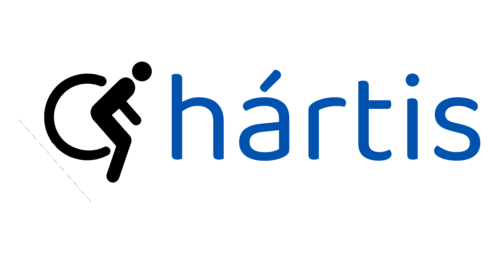
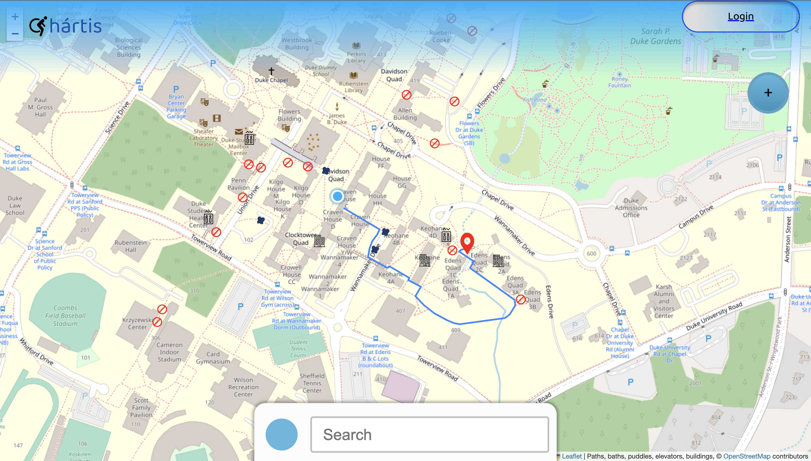
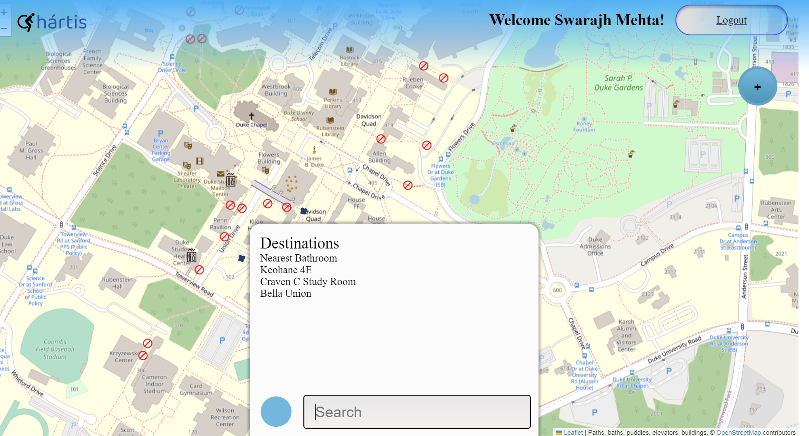
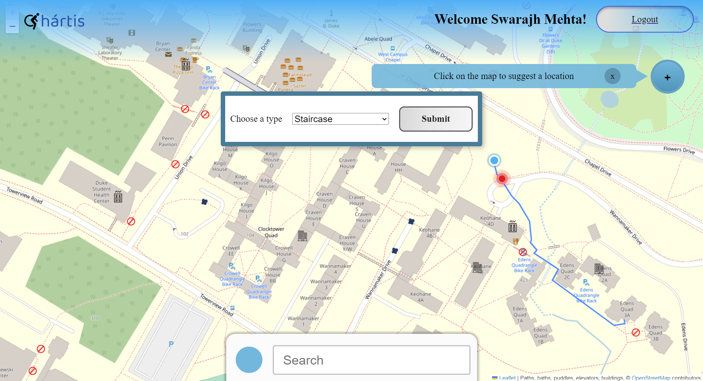
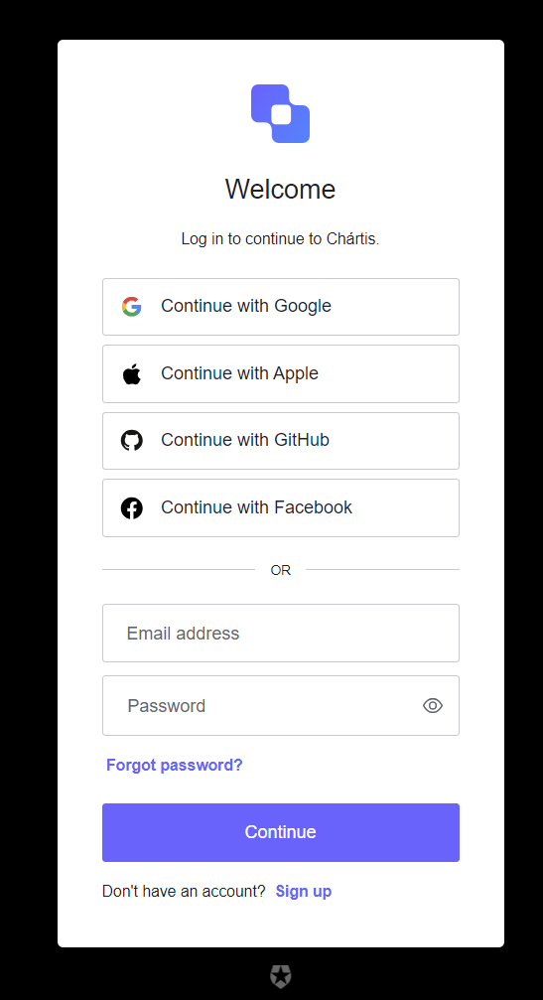

# HackDuke Auth0 Award Winners
Team: **Swarajh Mehta (Team lead)** (Back-end python & mongoDB with fastAPI), **Bruno Makoto** (Leaflet & layer management), **Alejandro Herera** (Front end design with React/CSS), **Hung Le** (Config set-up & Auth0 integration)

# Chártis: Navigating Education, Empowering Inclusion

<p align="center">
  
</p>

## Inspiration
Our journey with Chártis began with a simple observation - Duke University has a lot of educational resources, but they are not all easily accessible to everyone. A close friend’s experience using crutches due to a leg injury highlighted a gap in the knowledge and utilization of the university’s existing accessibility features. This inspired us to create a project to bridge this gap and make education more accessible. Hopefully, Chártis could help students make the most out of their Duke experience.

## Project Goals
Our primary goal was to develop a map and navigation tool. We envisioned a platform that would seamlessly integrate open-source data with user-input markers to provide comprehensive accessibility information.

##  Building the Project
### Interactive Map and Navigation
Our project's core feature is an interactive map of Duke University. Leveraging the Open Street Maps database, we displayed a detailed map of the campus. Users can also access building floor plans to locate the nearest accessible restrooms and elevators. The routing feature enabled users to navigate to any destination on campus, with the real-time feedback of the path dynamically adjusting as they progressed. 

<p align="center">
  
  
</p>


### Crowdsourcing Accessibility Data
Through a crowdsourcing feature, users can contribute data on the locations of staircases, accessible bathrooms, elevators, ramps, and more. Additionally, we introduced functionality for short-term data, such as users reporting puddles or flooded areas. Leveraging the dynamic nature of mongoDB atlas as well as its programmable triggers allows us to effectively manipulate this data. These user-generated markers are not only visible to users on the map, but they also influence the routing algorithm. For example, the algorithm can find routes that avoid staircases based on this collected data.

<p align="center">
  
  <br>
  <em>UI for inputting data</em>
</p>

## Future Development
Looking ahead, we envision several exciting developments for Chártis. We incorporated Auth0 authentication for user profiles, allowing for a personalised experience. We imagine developing this idea for increased customizability: for instance, users with crutches could customize the routing algorithm to prioritize routes with short, manageable staircases (such as the ones outside craven) instead of having to take large staircases or none at all. This dynamic adaptation would further enhance the user experience and inclusivity of the platform.

<p align="center">
  
  <br>
  <em>The current Chártis Auth-0 integration</em>
</p>

## Challenges
Building Chártis came with its fair share of challenges. Making the user-inputted data modulate the models we made for routing required a lot of problem solving and collaboration. We also challenged ourselves to imagine how we could make the project more accessible resulting in some over-ambitious features that had to be scaled back due to time constraints. This was also the first full stack project and first hackathon for half our team, so despite the challenges, we are all really happy with what we accomplished this week.

In conclusion, Chártis is a navigation tool with the goal to make education more accessible and inclusive. We hope to collaborate with Duke to make this project more available to Duke students.


# Try Chártis (Installation Guide)

Follow these steps to set up and run the project locally.

## Prerequisites

Before you begin, ensure you have the following software installed on your system:

- [Python 3](https://www.python.org/downloads/)
- [Node.js](https://nodejs.org/)
- [npm](https://www.npmjs.com/get-npm)

## Step 1: Clone the Repository

```bash
git clone <Swahaha/Chartis.git>
cd <Chartis>
```

## Step 2: Set Up the Backend

### 2.1. Install Python Dependencies

```bash
cd api
```

Navigate to the "api" directory:

```bash
python3 -m uvicorn main:app --reload
```

Annytime you run into a dependency issue, stop the command, install that specific dependency, and run the command again.

Using this greedy algorithm, this command will help install the required Python dependencies for the backend and start the backend server.

The backend server will be accessible at `localhost:8000`.

## Step 3: Set Up the Frontend

### 3.1. Install Node.js Dependencies

```bash
cd ../app
```

Navigate back to the main project directory and then into the "app" directory:

```bash
npm i
```

This command installs the required Node.js dependencies for the frontend.

### 3.2. Run the Frontend Development Server

```bash
npm run dev
```

The frontend development server will be accessible at `localhost:3000`.

## Step 4: Access the Application

- To access the frontend, open your web browser and navigate to `localhost:3000`.
- To access the backend (FastAPI), use any API testing tool or access it via `localhost:8000`.

## Step 5: Enjoy!

You've successfully set up and run Chártis locally. Feel free to explore and modify the code to suit your needs.